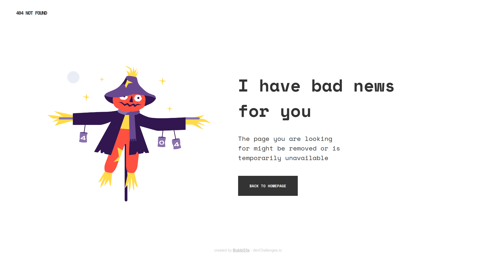
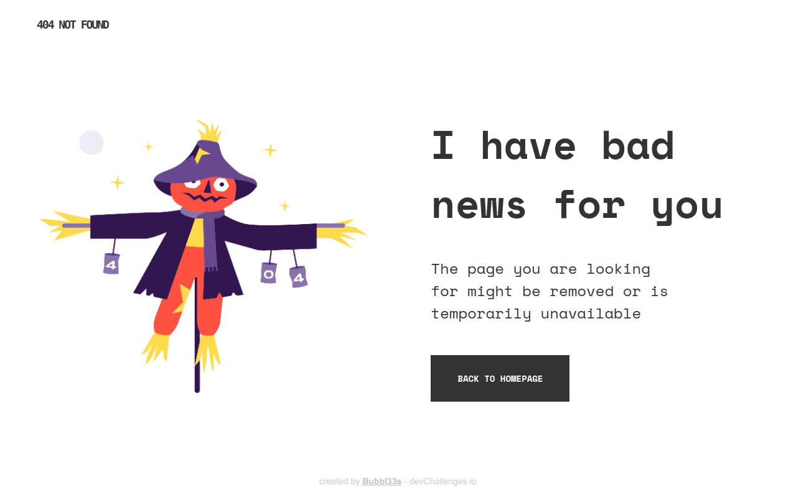
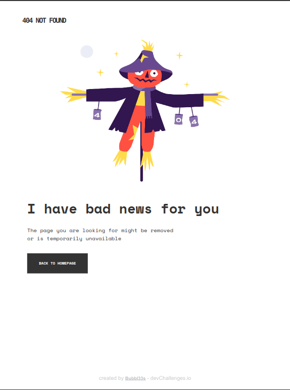
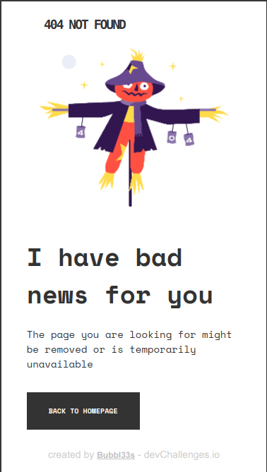

# Make It Real - NAME OF THE PROJECT

This is a solution to the '**404 not found**' project of the Make It Real course.

## Table of contents

- [Overview](#overview)
  - [The challenge](#the-challenge)
  - [Resultado](#resultado)
- [My process](#my-process)
  - [Built with](#built-with)
  - [What I learned](#what-i-learned)
  - [Continued development](#continued-development)
  - [Useful resources](#useful-resources)
- [Author](#author)
- [Acknowledgments](#acknowledgments)

## Overview

### The challenge

- Diseñar una página de 404 not found
- La página debe ser responsiva
- Considerar al menos dos dispositivos:
  - Mobile: 375px
  - Desktop: 1440px

### Resultado esperado


## Resultado

- Desktop
  <br />
  
  <br />

- Nest Hub Max
  <br />
  
  <br />

- iPad Mini & iPhone SE
  <br />
  
  

## My process

### Built with

- Semantic HTML5 markup
- CSS custom properties
- CSS media queries
- Flexbox
- Desktop-first workflow

### What I learned

Use this section to recap over some of your major learnings while working through this project. Writing these out and providing code samples of areas you want to highlight is a great way to reinforce your own knowledge.

To see how you can add code snippets, see below:

```html
<h1>Some HTML code I'm proud of</h1>
```

```css
.proud-of-this-css {
  color: papayawhip;
}
```

```js
const proudOfThisFunc = () => {
  console.log("🎉");
};
```

If you want more help with writing markdown, we'd recommend checking out [The Markdown Guide](https://www.markdownguide.org/) to learn more.

### Continued development

Use this section to outline areas that you want to continue focusing on in future projects. These could be concepts you're still not completely comfortable with or techniques you found useful that you want to refine and perfect.

### Useful resources

- [Color Picker](https://snapcraft.io/color-picker) - Me sirvió para obtener de una forma más aproximada los colores que no fueron proporcionados.
- [Google Fonts](https://fonts.google.com/) - Me proporcionó la fuente principal usada en el proyecto.
- [Optimizilla](https://imagecompressor.com/) - Para optimizar las screenshots.

## Author

Valeria Lozano - a.k.a. Bubbl33s

- [GitHub](https://www.your-site.com)
- [Codepen](https://codepen.io/Bubbl33s)

## Acknowledgments

- Make it Real mentors
- Brave AI-generated answer
- Linus Torlalds
- Rick Astley
